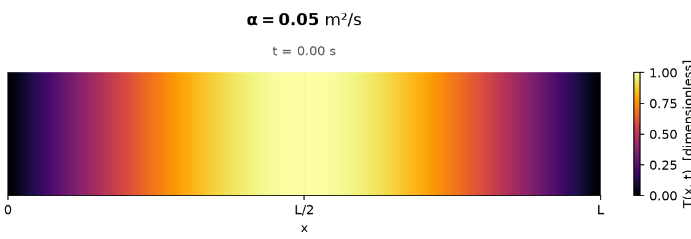
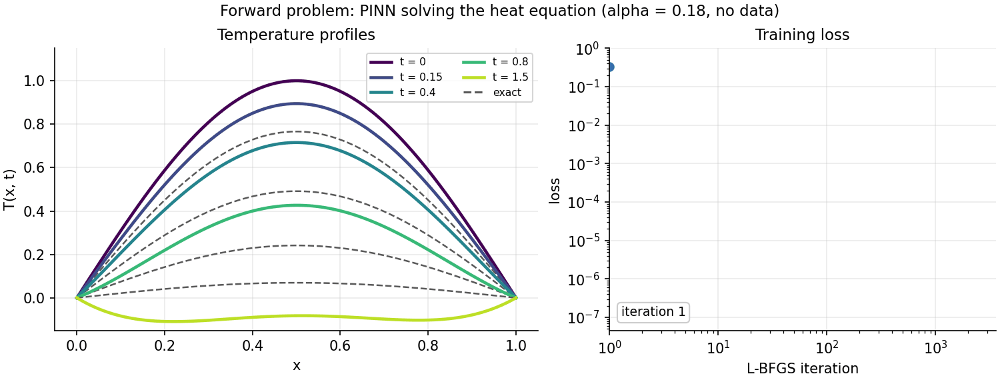
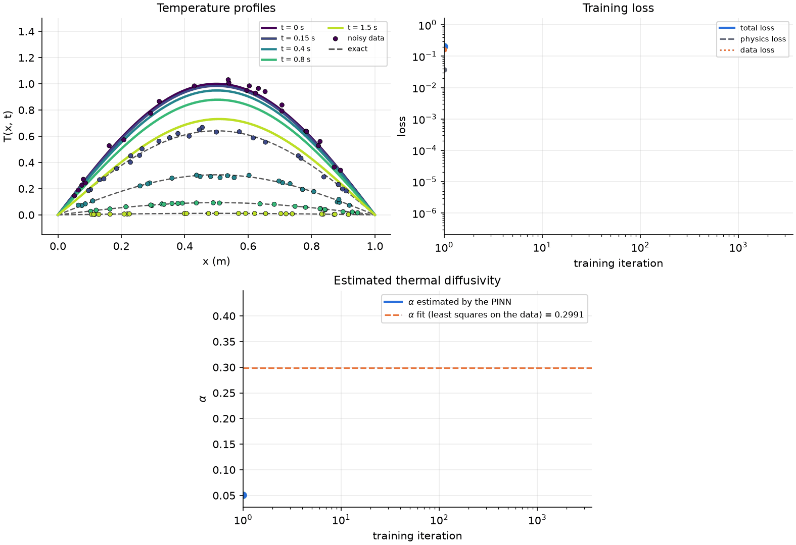
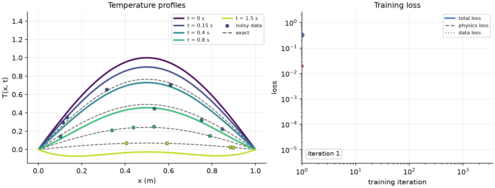
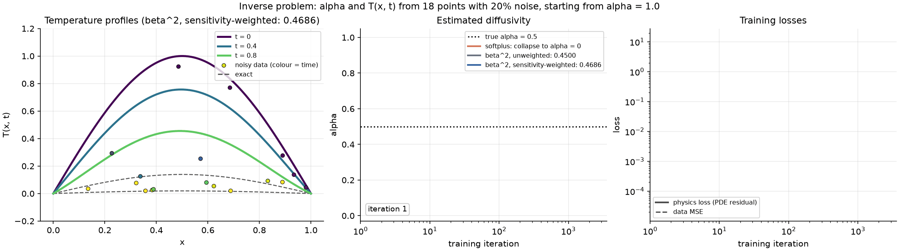
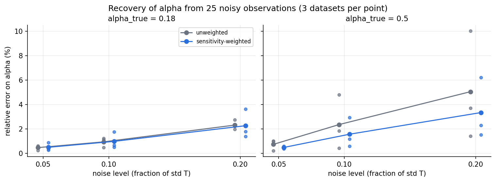

# Physics-Informed Neural Networks for 1D heat diffusion (development in progress)


---

This repository contains a compact implementation of **Physics-Informed Neural Networks (PINNs)** for the one-dimensional heat problem.

## Why PINNs?

Over the past few years, **Scientific Machine Learning (SciML)** has grown in popularity for its ability to speed up scientific research and innovation. Unlike most established machine learning models, which learn only from data, **SciML injects scientific knowledge into the learning process**. **PINNs** are one SciML methodology: they **train on the governing physical equations alongside experimental data**, ensuring predictions stay consistent with the physics. With recent advances, SciML could benefit research and industry by bypassing the cost of expensive experiments and simulations.

## The problem

A bar of arbitrary material (metal, ceramic, etc.) **starts hot in the middle, with both ends held at zero temperature**, so heat drains out and the bar cools down over time. **The cooling speed depends on the thermal diffusivity**, which depends on the bar's material properties. From this, two problems can be addressed:

- the **forward problem**: given the thermal diffusivity, what does the temperature look like everywhere, at every time?
- the **inverse problem**: given only a few noisy temperature measurements, what is the thermal diffusivity?

The one-dimensional **heat problem** studied here is well known, with an exact solution, which turns it into a **controlled laboratory that lets the PINN methodology be pushed to its limits**. It is therefore a **good benchmark before applying PINNs to more realistic, non-ideal problems**.

<p align="center">
  
</p>

**Fig 0:** Heat diffusion along a bar of arbitrary length $L$, for different thermal diffusivities $\alpha$ (m²/s). Larger $\alpha$ means faster diffusion: the bar reaches equilibrium (temperature $T$ equals 0 everywhere) sooner. **[Try the interactive version](https://qp-dev-ai.github.io/pinn-heat-diffusion_1D/interactive/heat_bar_explorer.html)** — adjust $\alpha$ and the initial condition live.

## Forward problem

In the forward problem, the thermal diffusivity $\alpha$, the initial condition, and the boundary conditions are known. The goal is to reconstruct the temperature field $T(x,t)$. The PINN is trained using the heat equation and the prescribed conditions alone, and its predictions are compared with the analytical solution. The forward problem may also use both data and the physics to reconstruct the temperature profile (see [Details](#details-equation-method-parameter-identifiability-robustness-study)).

<p align="center">
  
</p>

**Fig 1:** *Forward problem with no data.* With $\alpha = 0.18$ known, the PINN approximates the solution of the 1D heat equation using the governing equation and the initial and boundary conditions, without any temperature measurements. The predicted temperature profiles are compared with the analytical solution at several times (dashed lines). The right panel shows the evolution training loss.

## Inverse problem

In the inverse problem, only the initial and boundary conditions are known: the thermal diffusivity $\alpha$ and the temperature field $T(x,t)$ are both estimated together from sparse, noisy temperature measurements (see [Details](#details-equation-method-parameter-identifiability-robustness-study) for how the choice of $\alpha$ parameterization can make or break this).

<p align="center">
  
</p>

**Fig 2:** *Inverse problem.* Starting from a wrong guess ($\alpha_0 = 0.1$), the PINN recovers both the temperature field and the thermal diffusivity from 125 noisy measurements (10% noise, true $\alpha$ = $\alpha_{fit}$ = 0.3$). 1) predicted profiles (solid lines) against the exact solution (dashed lines). 2) the total, physics-only, and data-only components of the loss. 3) 2) the estimated thermal diffusivity $\alpha$ (solid line) converging toward $\alpha_{fit}$ (dashed line) — a classical least-squares fit of the exact solution to the data alone.

As with the forward problem, a PINN has limited advantage here on its own: this 1D case has a known analytical solution, so the classical fit above already recovers $\alpha$ about as well as the PINN does. PINNs become genuinely valuable for inverse problems on equations with **no analytical solution** — most real PDEs — where a classical curve fit isn't an option; folding the governing physics into the loss is what turns sparse, noisy measurements into a well-posed estimation problem there.

<details>
<summary>

## Details: equation, method, parameter identifiability, robustness study

</summary>

### Equation and analytical solution

The equation for the 1D heat diffusion problem is:

$$
\frac{\partial T}{\partial t} = \alpha \frac{\partial^2 T}{\partial x^2}, \qquad x \in [0, L],\ t \in [0, t_{\max}]
$$

The initial conditions are:

- $T(x, 0) = \sin(\pi x / L)$: **the bar's initial temperature profile, hot in the middle and zero at the ends**;
- $T(0, t) = 0$ and $T(L, t) = 0$ for every $t$ up to $t_{\max}$: **both ends sit in an infinite $T=0$ reservoir**, so heat continuously drains out there.

The exact solution is 𝑻(𝒙,𝒕) = 𝒔𝒊𝒏(𝝅𝒙/𝑳) × 𝒆<sup>−𝜶(𝝅/𝑳)²𝒕</sup> ($T$ is dimensionless, normalized so the initial temperature peak is 1, at t = 0 and x = L/2).

### Forward problem with data

<p align="center">
  
</p>

**Fig 1b:** *Forward problem, with data.* Same setup as Fig 1, but a handful of synthetic, artificially noised temperature measurements. Note that there is no data point on the $t=0$ (purple) curve: it is the fixed initial condition, not something to measure. The right panel separates the total, physics-only, and data-only components of the loss; total and data loss overlap once training converges, indicating that in general noisy data drives the training.

### Method

| Component | Choice | Why |
|---|---|---|
| Network | MLP, 3 hidden layers × 16 neurons, `tanh` | Smooth activation, needed for second derivatives |
| Initialization | Glorot uniform | Keeps the variance of activations and gradients stable across layers |
| Initial and boundary conditions | **Hard constraints** via the ansatz $T_\theta = \sin(\pi x) + t\,x(1-x)\,\mathcal{N}_\theta(x,t)$ | IC and BC hold exactly, so there are no competing penalty terms |
| PDE residual | $R = \partial_t T_\theta - \alpha\, \partial_{xx} T_\theta$ by automatic differentiation (`jax.grad` + `jax.vmap`) | Exact derivatives, no mesh |
| Collocation | 500 points, Latin Hypercube Sampling | Even coverage of the space-time domain |
| Unknown parameter | $\alpha = \alpha_{\min} + \beta^2$, with $\beta$ trainable | Keeps $\alpha > 0$ and avoids the collapse to $\alpha = 0$ (Fig 2) |
| Loss | $\mathcal{L} = \overline{R^2} + \lambda\, \overline{w\,(T_\theta - T_{\text{obs}})^2}$ | Physics plus (optionally weighted) data fit |
| Optimizer | L-BFGS (`jaxopt`), float64 | Converges quickly and reliably on smooth PINN losses |

### Parameter identifiability and sensitivity weighting

Not every measurement carries the same information about $\alpha$. The sensitivity of the solution to the parameter is

$$
S_\alpha(x,t) = \frac{\partial T}{\partial \alpha} = -\pi^2\, t\, \sin(\pi x)\, e^{-\alpha \pi^2 t}.
$$

It is **zero at $t=0$**, because the initial profile does not depend on $\alpha$. It is also **negligible at late times**, when the temperature has decayed below the noise. It peaks at $t^* = 1/(\alpha\pi^2)$ in the middle of the bar. When $\alpha$ is large, diffusion is fast and the informative time window shrinks, so identification gets harder.

The repository implements a **two-stage sensitivity-weighted** training:
1. An unweighted inverse PINN gives a first estimate $\alpha_1$.
2. The data loss is then reweighted by $w_i = \max\big((|S_\alpha(x_i,t_i;\alpha_1)| / \max|S_\alpha|)^{1/2},\ w_{\min}\big)$, and the network is retrained.

The weights are applied only to the data loss. The PDE residual has to hold everywhere, including in regions that carry little information about $\alpha$.

### Comparing alpha parameterizations

<p align="center">
  
</p>

**Fig 2c:** *Comparing $\alpha$ parameterizations.* Starting from a wrong guess ($\alpha_0 = 1.0$), the PINN learns both the temperature field and the thermal diffusivity from 18 noisy measurements (20% noise, true $\alpha = 0.5$). The same dataset is used for three training variants:

- 🟠 **$\alpha = \text{softplus}(\beta)$.** The first L-BFGS step sends $\beta$ to a large negative value. Softplus then saturates ($\alpha \approx 10^{-31}$, $d\alpha/d\beta \approx 0$), so $\alpha$ can never recover. The network is stuck on the **trivial solution $\alpha \to 0$**, and both losses plateau near $10^{-1}$.
- ⚪ **$\alpha = \alpha_{\min} + \beta^2$, unweighted.** The gradient $d\alpha/d\beta = 2\beta$ only shrinks linearly as $\alpha \to 0$. $\alpha$ therefore dips to about 0.06, recovers once the network has fitted the data, and reaches $\hat\alpha = 0.450$ (10.0% error).
- 🔵 **$\alpha = \alpha_{\min} + \beta^2$, sensitivity-weighted.** Measurements are reweighted by their sensitivity to $\alpha$ (above), giving $\hat\alpha = 0.469$ (6.2% error).

Left panel: profiles of the sensitivity-weighted run (solid) against the exact solution (dashed), with the measurements coloured by time. Right panel: physics loss (solid) and data MSE (dashed). This dataset is one where the weighting helps markedly; the statistics over many datasets are given below.

### Robustness study

The table below covers **36 inverse problems**: two diffusivities, three noise levels, three random datasets of 25 points, each solved with and without sensitivity weighting.

<p align="center">
  
</p>

**Fig 3:** Relative error on the recovered $\alpha$ against the noise level. Each dot is one dataset; lines show the mean over datasets.

| $\alpha_{\text{true}}$ | noise | unweighted: mean (max) error | sensitivity-weighted: mean (max) error |
|:---:|:---:|:---:|:---:|
| 0.18 | 5% | 0.47% (0.62%) | 0.49% (0.88%) |
| 0.18 | 10% | 0.94% (1.23%) | 0.98% (1.76%) |
| 0.18 | 20% | 2.31% (2.76%) | 2.26% (3.63%) |
| 0.5 | 5% | 0.73% (1.01%) | 0.48% (0.59%) |
| 0.5 | 10% | 2.35% (4.81%) | 1.56% (2.93%) |
| 0.5 | 20% | 5.05% (10.02%) | 3.34% (6.20%) |

*Relative error on $\alpha$, mean and worst case over 3 datasets of 25 points; initial guess $\alpha_0 = 1.0$.*

**Takeaways**
- $\alpha$ is recovered to within a few percent from only ~25 noisy measurements, starting from an initial guess that is off by a factor of 2 to 6.
- The error grows with the noise level and depends strongly on the particular dataset. A single successful run proves little, so results are always reported over several seeds.
- **The effect of the sensitivity weighting depends on the regime.** For $\alpha = 0.18$ it changes nothing measurable. For $\alpha = 0.5$ it reduces the mean error by about one third at every noise level, and the worst case at 20% noise from 10.0% to 6.2%. Faster diffusion shrinks the time window in which measurements are informative, so emphasizing the informative points matters more.

<!-- DATA_SIZE -->

</details>

## Documentation

- 📄 [**Technical note**](docs/note/pinn_heat_1d_note.pdf) (4 pages): problem, method, results and identifiability analysis.
- 🔧 [**Implementation details**](docs/implementation/implementation_details.pdf): every modelling choice, hyperparameter, seed and evaluation protocol, the software versions used, the differences from the original research code, and the known limitations.

## Installation

```bash
git clone https://github.com/qp-dev-ai/pinn-heat-diffusion_1D.git
cd pinn-heat-diffusion_1D
pip install -r requirements.txt
```

## Getting started

```bash
python scripts/diffusion.py                # Fig 0: diffusion animation    -> figures/diffusion_alpha.gif
python scripts/forward.py                  # Fig 1: forward problem        -> figures/forward_*
python scripts/inverse_simple.py           # Fig 2: inverse problem, single run -> figures/inverse_simple_training.gif
python scripts/inverse.py                  # Fig 2c: comparing alpha parameterizations -> figures/inverse_*
python scripts/inverse.py --alpha_true 0.18 --noise 0.1 --n_obs 50
python scripts/robustness_study.py         # Fig 3 (~30 min on CPU)        -> results/robustness_study.csv
python scripts/data_size_study.py          # Fig 4 (~1 h on CPU)           -> results/data_size_study.csv
```

Or use the library directly:

```python
from pinn_heat import noisy_observations
from pinn_heat.inverse import fit_inverse

obs = noisy_observations(n=25, alpha=0.18, noise_level=0.10, seed=0)
params, history, alpha_hat = fit_inverse(obs, alpha_init=1.0)                      # beta^2 (default)
_, _, alpha_collapsed = fit_inverse(obs, alpha_init=1.0, alpha_param="softplus")   # collapses to ~0
```

## Repository structure

```
pinn_heat/
  physics.py    exact solution and sensitivity dT/dalpha
  model.py      MLP, Glorot initialization, hard-constrained ansatz, alpha parameterizations
  data.py       Latin Hypercube collocation points, noisy synthetic observations
  pinn.py       PDE residual (autodiff), losses, L-BFGS training loop
  inverse.py    inverse fit and sensitivity weights
  plotting.py   figure style
  animate.py    training animations, diffusion-bar animation
scripts/        diffusion.py, forward.py, inverse_simple.py, inverse.py, robustness_study.py, data_size_study.py
figures/        generated figures and animations
results/        study results (CSV)
docs/           technical note, implementation details (PDF + LaTeX source), interactive diffusion explorer
```

## Roadmap

- [ ] Sensitivity estimated without the analytical solution (sensitivity equation or finite differences on the PINN)
- [ ] Galerkin-type (weak-form) residual constraints to improve identifiability
- [ ] Nonlinear diffusion, 2D geometries, and validation on experimental data

## References

- M. Raissi, P. Perdikaris, G. E. Karniadakis, *Physics-informed neural networks: A deep learning framework for solving forward and inverse problems involving nonlinear partial differential equations*, J. Comput. Phys. 378 (2019).
- G. E. Karniadakis et al., *Physics-informed machine learning*, Nat. Rev. Phys. 3 (2021).
- S. Wang, Y. Teng, P. Perdikaris, *Understanding and mitigating gradient flow pathologies in physics-informed neural networks*, SIAM J. Sci. Comput. 43 (2021).
- J. V. Beck, K. J. Arnold, *Parameter Estimation in Engineering and Science*, Wiley (1977).

## Author

**Quentin Pontalier**: engineering physicist moving into scientific machine learning. This is a personal research project; feedback and discussion are welcome.
