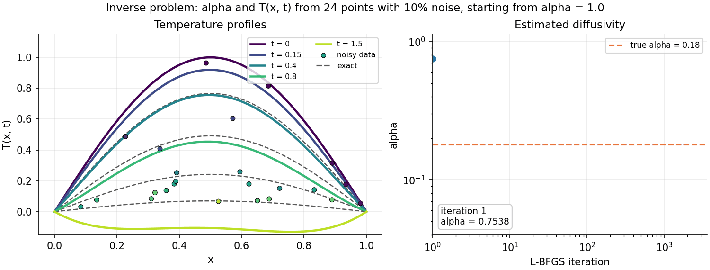

# Physics-Informed Neural Networks for 1D heat diffusion


---

This repository contains a compact **JAX** implementation of physics-informed neural networks (PINNs) for the one-dimensional heat equation. It solves:

- the **forward problem**: given the thermal diffusivity $\alpha$, reconstruct the temperature field $T(x,t)$ from the physics alone, with no data;
- the **inverse problem**: estimate the unknown diffusivity $\alpha$ together with $T(x,t)$ from **sparse and noisy temperature measurements**.

The 1D heat equation has an analytical solution. That makes it a controlled setting for studying how PINNs behave: optimization, parameter identifiability, and robustness to noise. The problems met here (identifiability, loss balancing, noise sensitivity) are the same ones met on realistic problems.

<p align="center">
  
</p>

**Fig 1:** *Inverse problem.* The PINN starts from a wrong guess ($\alpha_0 = 1.0$) and learns both the temperature field and the diffusivity from 24 noisy measurements (10% noise). Solid lines are PINN profiles at fixed times, dashed lines the exact solution, and dots the measurements (coloured by time). The recovered diffusivity is $\hat\alpha = 0.1780$, against a true value of $0.18$.

---

## The problem

$$
\frac{\partial T}{\partial t} = \alpha \frac{\partial^2 T}{\partial x^2}, \qquad x \in [0, 1],\ t \in [0, 1.5]
$$

$$
T(x, 0) = \sin(\pi x), \qquad T(0, t) = T(1, t) = 0
$$

The exact solution is $T(x,t) = \sin(\pi x)\, e^{-\alpha \pi^2 t}$. It is used only to generate synthetic measurements and to evaluate the results.

## Method

| Component | Choice | Why |
|---|---|---|
| Network | MLP, 3 hidden layers × 16 neurons, `tanh` | Smooth activation, needed for second derivatives |
| Initialization | Glorot uniform | Keeps the variance of activations and gradients stable across layers |
| Initial and boundary conditions | **Hard constraints** via the ansatz $T_\theta = \sin(\pi x) + t\,x(1-x)\,\mathcal{N}_\theta(x,t)$ | IC and BC hold exactly, so there are no competing penalty terms |
| PDE residual | $R = \partial_t T_\theta - \alpha\, \partial_{xx} T_\theta$ by automatic differentiation (`jax.grad` + `jax.vmap`) | Exact derivatives, no mesh |
| Collocation | 500 points, Latin Hypercube Sampling | Even coverage of the space-time domain |
| Unknown parameter | $\alpha = \alpha_{\min} + \beta^2$, with $\beta$ trainable | Guarantees $\alpha > 0$ during training |
| Loss | $\mathcal{L} = \overline{R^2} + \lambda\, \overline{w\,(T_\theta - T_{\text{obs}})^2}$ | Physics plus (optionally weighted) data fit |
| Optimizer | L-BFGS (`jaxopt`), float64 | Converges quickly and reliably on smooth PINN losses |

<p align="center">
  
</p>

**Fig 2:** *Forward problem.* With $\alpha$ known and **no data at all**, the PINN finds the solution of the heat equation by minimizing the PDE residual alone. After 3000 L-BFGS iterations (~30 s on a laptop CPU) the relative $L^2$ error is **$6 \times 10^{-5}$**.

## Parameter identifiability and sensitivity weighting

Not every measurement carries the same information about $\alpha$. The sensitivity of the solution to the parameter is

$$
S_\alpha(x,t) = \frac{\partial T}{\partial \alpha} = -\pi^2\, t\, \sin(\pi x)\, e^{-\alpha \pi^2 t}.
$$

It is **zero at $t=0$**, because the initial profile does not depend on $\alpha$. It is also **negligible at late times**, when the temperature has decayed below the noise. It peaks at $t^* = 1/(\alpha\pi^2)$ in the middle of the bar. When $\alpha$ is large, diffusion is fast and the informative time window shrinks, so identification gets harder.

The repository implements a **two-stage sensitivity-weighted** training:
1. An unweighted inverse PINN gives a first estimate $\alpha_1$.
2. The data loss is then reweighted by $w_i = \max\big((|S_\alpha(x_i,t_i;\alpha_1)| / \max|S_\alpha|)^{1/2},\ w_{\min}\big)$, and the network is retrained.

The weights are applied only to the data loss. The PDE residual has to hold everywhere, including in regions that carry little information about $\alpha$.

## Robustness study

The table below covers **36 inverse problems**: two diffusivities, three noise levels, three random datasets of 25 points, each solved with and without sensitivity weighting.

<p align="center">
  
</p>

**Fig 3:** Relative error on the recovered $\alpha$ against the noise level. Each dot is one dataset; lines show the mean over datasets.

<!-- RESULTS_TABLE -->

**Takeaways**
- $\alpha$ is recovered to within a few percent from only ~25 noisy measurements, starting from an initial guess that is off by a factor of 2 to 5.
- The error grows with the noise level and depends strongly on the particular dataset. A single successful run proves little, so results are always reported over several seeds.
- <!-- WEIGHTING_TAKEAWAY -->

## Installation

```bash
git clone https://github.com/qp-dev-ai/pinn-heat-diffusion_1D.git
cd pinn-heat-diffusion_1D
pip install -r requirements.txt
```

## Getting started

```bash
python scripts/forward.py                             # forward problem       -> figures/forward_*.png, forward_training.gif
python scripts/inverse.py                             # inverse problem       -> figures/inverse_*_none.*
python scripts/inverse.py --weighting sensitivity     # two-stage weighting   -> figures/inverse_*_sensitivity.*
python scripts/inverse.py --alpha_true 0.5 --noise 0.2 --n_obs 50
python scripts/robustness_study.py                    # full study (~30 min on CPU) -> results/robustness_study.csv
```

Or use the library directly:

```python
from pinn_heat import noisy_observations
from pinn_heat.inverse import fit_inverse

obs = noisy_observations(n=25, alpha=0.18, noise_level=0.10, seed=0)
params, history, alpha_hat = fit_inverse(obs, alpha_init=1.0)
print(alpha_hat)   # ~0.178
```

## Repository structure

```
pinn_heat/
  physics.py    exact solution and sensitivity dT/dalpha
  model.py      MLP, Glorot initialization, hard-constrained ansatz, alpha reparameterization
  data.py       Latin Hypercube collocation points, noisy synthetic observations
  pinn.py       PDE residual (autodiff), losses, L-BFGS training loop
  inverse.py    inverse fit and two-stage sensitivity-weighted fit
  plotting.py   figure style
  animate.py    training animations
scripts/        forward.py, inverse.py, robustness_study.py
figures/        generated figures and animations
results/        robustness study results (CSV)
```

## Roadmap

- [ ] Sensitivity estimated without the analytical solution (sensitivity equation or finite differences on the PINN)
- [ ] Galerkin-type (weak-form) residual constraints to improve identifiability
- [ ] Nonlinear diffusion, 2D geometries, and validation on experimental data

## References

- M. Raissi, P. Perdikaris, G. E. Karniadakis, *Physics-informed neural networks: A deep learning framework for solving forward and inverse problems involving nonlinear partial differential equations*, J. Comput. Phys. 378 (2019).
- G. E. Karniadakis et al., *Physics-informed machine learning*, Nat. Rev. Phys. 3 (2021).
- S. Wang, Y. Teng, P. Perdikaris, *Understanding and mitigating gradient flow pathologies in physics-informed neural networks*, SIAM J. Sci. Comput. 43 (2021).
- J. V. Beck, K. J. Arnold, *Parameter Estimation in Engineering and Science*, Wiley (1977).

## Author

**Quentin Pontalier**: engineering physicist moving into scientific machine learning. This is a personal research project; feedback and discussion are welcome.
